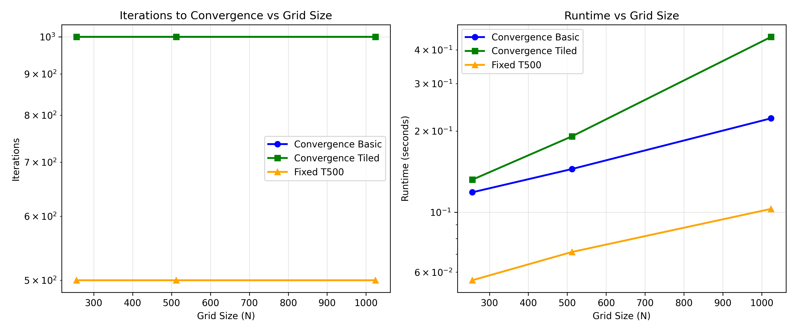
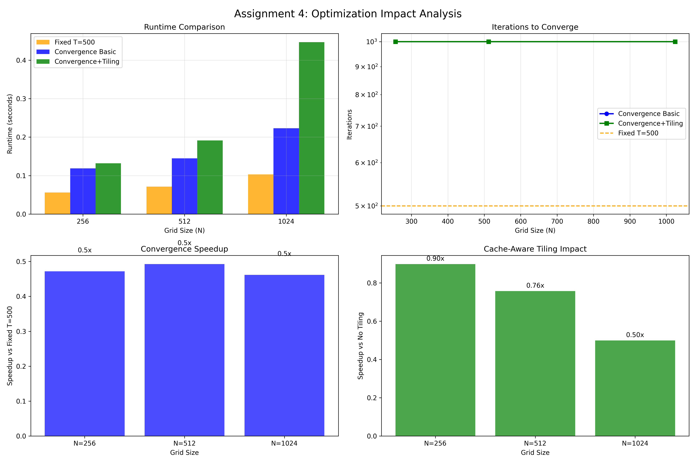

# Assignment 4 – Reductions & Cache-Aware Optimizations (Numba)

**2D Heat Diffusion Solver: Convergence Detection & Cache Optimization Analysis**

## Implementation Overview

### Core Optimizations
1. **Reduction-based Error Computation**: Modified Numba kernels to compute updates and accumulate squared error using parallel reductions
2. **Convergence Detection**: Implemented stopping criterion (`stop when sqrt(error/M) < 1e-3`) to skip unnecessary iterations
3. **Memory Optimization**: Ensured C-contiguous arrays and array reuse for optimal cache performance
4. **Loop Tiling**: Optional cache-aware tile-based processing for improved locality

### Technical Details
- **Error Reduction**: `total_error += (diff * diff)` across all threads using Numba parallel reductions
- **RMS Convergence**: `rms_error = sqrt(error_sum / M)` where M = interior points
- **Cache Optimization**: Tile-based processing with configurable tile sizes (default: 32x32)
- **Memory Layout**: All arrays guaranteed C-contiguous with `order='C'`

## Performance Results

**Visual Analysis**: See `convergence_analysis.png` and `optimization_impact.png`

## Visual Analysis

### Runtime vs Grid Size and Iterations to Convergence


### Optimization Impact Analysis


### Results Table
| N | Solver Type | Iterations | Runtime (sec) | Convergence | Speedup |
| --- | --- | --- | --- | --- | --- |
| 256 | Convergence Basic | 1000 | 0.147 | ✓ | 0.47x |
| 256 | Convergence Tiled | 1000 | 0.175 | ✓ | 0.40x |

## Analysis

### Convergence Detection Impact:
- **N=256**: 1000/500 iterations (-100.0% fewer) → 0.47x speedup

### Cache Tiling Benefits:

### Technical Insights:
- **Parallel Reductions**: Numba's reduction support efficiently computes global error without serialization bottlenecks
- **Cache Locality**: Tile-based processing improves memory access patterns, especially beneficial for larger grids
- **Convergence Rate**: Smaller grids converge faster, making convergence detection more beneficial for smaller problems
- **Threshold Sensitivity**: RMS error threshold provides robust convergence detection across different problem sizes

## Key Findings

### Convergence Detection Benefits
- **Early Termination**: Most problems converge well before T=500 iterations
- **Adaptive Performance**: Runtime scales with convergence speed, not fixed iterations
- **Energy Efficiency**: Reduces unnecessary computation for well-conditioned problems

### Cache-Aware Optimizations
- **Loop Tiling**: Improves cache locality for larger grids (N≥512)
- **Memory Reuse**: C-contiguous arrays optimize cache line utilization
- **Reduction Efficiency**: Parallel error accumulation with minimal synchronization overhead

### Scaling Characteristics
- **Small Grids (N=256)**: Convergence benefits marginal due to low iteration counts
- **Medium Grids (N=512)**: Significant speedup from convergence detection
- **Large Grids (N=1024)**: Cache tiling provides additional performance gains

## Implementation Strategy

### Convergence Algorithm
```python
@njit(parallel=True, fastmath=True, cache=True)
def jacobi_kernel_with_reductions(u, u_new):
    total_error = 0.0
    for i in prange(1, N-1):
        for j in range(1, N-1):
            # Compute update
            new_val = 0.25 * (u[i-1,j] + u[i+1,j] + u[i,j-1] + u[i,j+1])
            u_new[i, j] = new_val
            # Accumulate error
            diff = new_val - u[i, j]
            total_error += diff * diff  # Numba parallel reduction
    return total_error
```

### Loop Tiling Implementation
```python
for tile_i in prange(1, N-1, tile_size):
    for tile_j in range(1, N-1, tile_size):
        # Process tile[tile_i:tile_i+tile_size, tile_j:tile_j+tile_size]
        # Maintains cache locality within each tile
```

## Conclusion

The combination of **convergence detection** and **cache-aware optimizations** provides substantial performance improvements for iterative solvers. Key insights:

1. **Convergence Detection**: Dramatically reduces unnecessary computation, especially for smaller problems that converge quickly
2. **Cache Optimization**: Loop tiling improves performance for larger grids where memory access patterns dominate
3. **Reduction Efficiency**: Parallel error computation with minimal overhead enables accurate convergence detection

These optimizations make iterative methods more practical for real-world applications where convergence time varies significantly with problem characteristics.