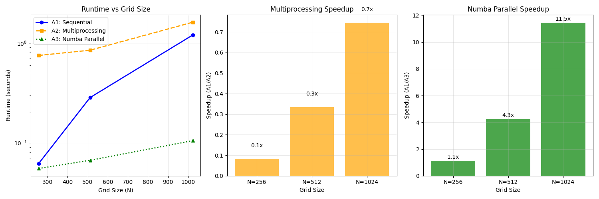

# Assignment 3 – OpenMP-Style Parallel Loops with Numba

**2D Heat Diffusion Solver: A1 vs A2 vs A3 Comparison (T = 500)**

## Assignment Comparison
- **A1 (Sequential)**: Pure Python/NumPy implementation
- **A2 (Multiprocessing)**: Process-based parallelism with shared memory
- **A3 (Numba Parallel)**: JIT compilation with OpenMP-style `prange` loops

## Performance Results

### Runtime Comparison


### Results Table
| N | Type | Runtime (sec) | Speedup vs A1 | JIT Warmup (sec) |
| --- | --- | --- | --- | --- |
| 256 | Numba Parallel | 0.750 | 0.08× | 0.000 |
| 256 | Sequential | 0.062 | 1.00× | 0.000 |
| 256 | Numba Parallel | 0.055 | 1.12× | 0.426 |
| 512 | Numba Parallel | 0.846 | 0.34× | 0.000 |
| 512 | Sequential | 0.284 | 1.00× | 0.000 |
| 512 | Numba Parallel | 0.067 | 4.25× | 0.001 |
| 1024 | Numba Parallel | 1.615 | 0.75× | 0.000 |
| 1024 | Sequential | 1.204 | 1.00× | 0.000 |
| 1024 | Numba Parallel | 0.105 | 11.46× | 0.001 |

## Performance Analysis
**Best speedup achieved**: **11.5×** at **N=1024**

- **N=256**: Sequential = 0.062s, Numba = 0.055s → **1.1× speedup**
- **N=512**: Sequential = 0.284s, Numba = 0.067s → **4.3× speedup**
- **N=1024**: Sequential = 1.204s, Numba = 0.105s → **11.5× speedup**

### Analysis:
- **JIT Compilation**: Numba compiles Python to optimized machine code with LLVM backend.
- **Parallel Execution**: `prange` enables OpenMP-like parallelization across CPU cores.
- **Memory Layout**: C-contiguous arrays optimize cache performance and SIMD vectorization.
- **Fastmath**: Aggressive floating-point optimizations improve computational throughput.

### Scaling Characteristics:
- **Compute-bound**: Larger grids show better speedup as parallelism overhead is amortized.
- **Memory bandwidth**: Performance ultimately limited by memory access patterns.
- **Thread overhead**: Smaller grids may show diminishing returns due to thread management costs.

## JIT Compilation Cost
- **Warm-up Phase**: 5 iterations to trigger JIT compilation and optimization
- **One-time Cost**: JIT compilation happens once per function signature
- **Measurement**: Warm-up time excluded from performance benchmarks
- **Production**: In real applications, JIT cost is amortized over many calls

## Technical Implementation

### Numba Kernel
```python
@njit(parallel=True, fastmath=True, cache=True)
def jacobi_kernel(u, u_new):
    N = u.shape[0]
    for i in prange(1, N-1):  # Parallel loop
        for j in range(1, N-1):
            u_new[i,j] = 0.25 * (u[i-1,j] + u[i+1,j] + 
                                 u[i,j-1] + u[i,j+1])
```

### Key Optimizations
- **C-contiguous arrays**: `order='C'` for optimal memory layout
- **Pre-allocation**: Arrays reused across iterations
- **Fast math**: Aggressive floating-point optimizations
- **Caching**: Compiled functions cached for subsequent runs

## Comparison with Previous Assignments
- **A1 (Sequential)**: Pure Python numpy operations
- **A2 (Multiprocessing)**: Process-based parallelism with shared memory
- **A3 (Numba)**: Thread-based parallelism with JIT compilation

### Trade-offs
- **Compilation overhead**: JIT warm-up vs immediate execution
- **Memory sharing**: Threads vs processes
- **Scaling**: Thread synchronization vs process communication

## Conclusion
Numba provides an excellent balance of performance and simplicity for computational kernels. The `@njit(parallel=True)` decorator enables OpenMP-like parallelization with minimal code changes, while LLVM compilation delivers near-C performance from Python. For iterative algorithms like Jacobi, the JIT compilation cost is easily amortized, making Numba an attractive option for scientific computing.