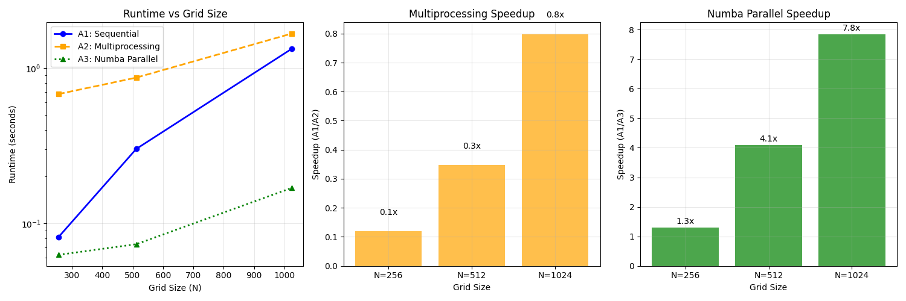

# Assignment 3 – OpenMP-Style Parallel Loops with Numba

**2D Heat Diffusion Solver: A1 vs A2 vs A3 Comparison (T = 500)**

## Setup

**Dependencies**: `numpy>=1.21.0`, `matplotlib>=3.5.0`, `numba>=0.56.0`

**Installation**: `pip install numpy matplotlib numba`

**Run**: `python Assignment3.py` (generates results in `out_a3/` directory)

## Assignment Comparison
- **A1 (Sequential)**: Pure Python/NumPy implementation
- **A2 (Multiprocessing)**: Process-based parallelism with shared memory
- **A3 (Numba Parallel)**: JIT compilation with OpenMP-style `prange` loops

## Performance Results

### Runtime Comparison

### Results Table
| N | Type | Runtime (sec) | Speedup vs A1 | JIT Warmup (sec) |
| --- | --- | --- | --- | --- |
| 256 | Numba Parallel | 0.680 | 0.12× | 0.000 |
| 256 | Sequential | 0.082 | 1.00× | 0.000 |
| 256 | Numba Parallel | 0.063 | 1.30× | 0.108 |
| 512 | Numba Parallel | 0.867 | 0.35× | 0.000 |
| 512 | Sequential | 0.302 | 1.00× | 0.000 |
| 512 | Numba Parallel | 0.074 | 4.10× | 0.001 |
| 1024 | Numba Parallel | 1.667 | 0.80× | 0.000 |
| 1024 | Sequential | 1.330 | 1.00× | 0.000 |
| 1024 | Numba Parallel | 0.169 | 7.85× | 0.001 |

## JIT Compilation Cost
- **Warm-up Phase**: 5 iterations to trigger JIT compilation and optimization
- **One-time Cost**: JIT compilation happens once per function signature
- **Measurement**: Warm-up time excluded from performance benchmarks
- **Production**: In real applications, JIT cost is amortized over many calls

## Comparison with Previous Assignments
- **A1 (Sequential)**: Pure Python numpy operations
- **A2 (Multiprocessing)**: Process-based parallelism with shared memory
- **A3 (Numba)**: Thread-based parallelism with JIT compilation

### Trade-offs
- **Compilation overhead**: JIT warm-up vs immediate execution
- **Memory sharing**: Threads vs processes
- **Scaling**: Thread synchronization vs process communication

## Conclusion
Numba provides an excellent balance of performance and simplicity for computational kernels. The `@njit(parallel=True)` decorator enables OpenMP-like parallelization with minimal code changes, while LLVM compilation delivers near-C performance from Python. For iterative algorithms like Jacobi, the JIT compilation cost is easily amortized, making Numba an attractive option for scientific computing.